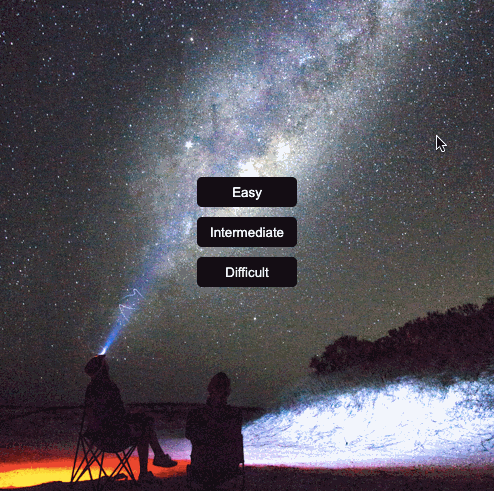

# &lt;my-flipping-tile&gt;

A web component representing a memory game.

## Attributes

### `level`

The `level` attribute, if present, specifies the size of the grid. Its value must be `easy` (4x4), `intermediate` (4x2) or `difficult` (2x2).

Default value: difficult

## Example

```html
<my-memory-game></my-memory-game>
```


