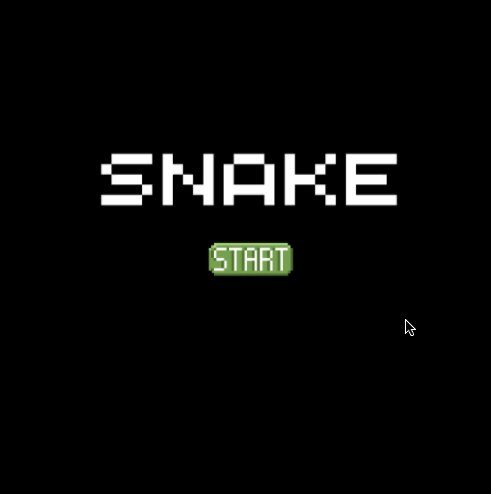

# &lt;my-snake-game&gt;

A web component representing a game of Snake.

## Events

| Event Name | Fired When           |
| ---------- | -------------------- |
| `quit` | The player press on no button when asked to play again. |

## Example

```html
<my-snake-game></my-snake-game>
```

