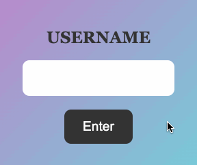

# &lt;my-nickname-form&gt;

A web component that represents a nickname form.

## Events

| Event Name | Fired When |
|------------|------------|
| `added`| The nickname is added.

## Example

```html
   <my-nickname-form></my-nickname-form>
```


