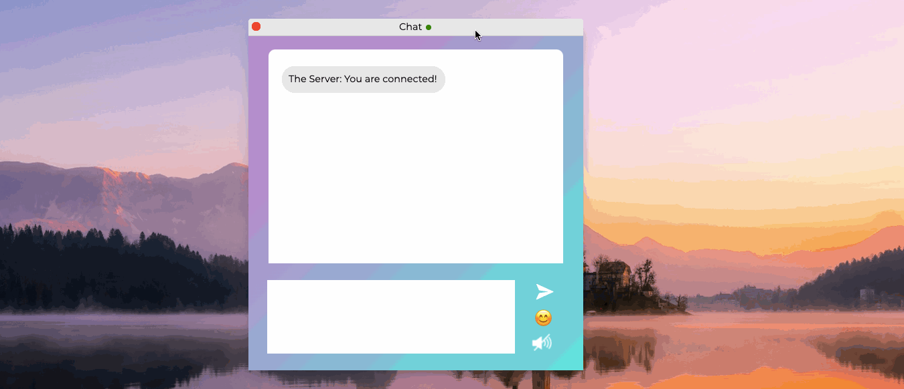

# &lt;my-window&gt;

A web component representing a draggable and closeable window.

## Events

| Event Name | Fired When           |
| ---------- | -------------------- |
| `focused` | The window is focused. |
| `closed` | The window is closed. |

## Example

```html
<my-window>
  <my-snake-app>
</my-window>
```

